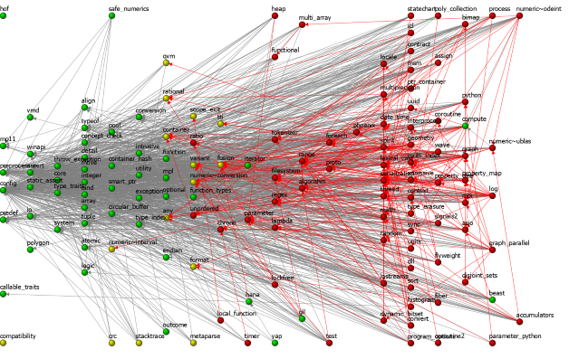

# BoostDepGraph
A tool to visualize the boost dpendency graph.

# Basic Usage
- First, you need a recursive copy of the boost project https://github.com/boostorg/boost
  (i.e. the `libs` sub-folder contains a copy of all boost libraries)

      git clone --recursive https://github.com/boostorg/boost

- After starting the program, you'll be asked for the boost root directory you want to analyze
- After analysis is finshed (which takes a couple of seconds on my system) it will show you
  the depednecny graph between the boost libraries:
  - A library `BoostA` depends on library `BoostB`, if any of the header or source files of `BoostA` (not the test files) includes any of the headers of librar `BoostB`
  - The analysis does not consider any form of conditional inclusion, so if e.g. Boost.Array
    is only included when compiled in pre-c++11 mode, it will still show a dependency
- The color coding of the nodes refers to their cmake status
  - Green: The library has a CMakeLists.txt file in its root directory
  - Yellow: There is no CMakeLists.txt file in the root, but all dependencies have one
  - Red: No CMakeLists.txt file present and at least one dependency (direct or indirect) is missing
- Controls:
  - Left clicking on a node will select it and highlight all connected edges
  - Right clkicking on a node will toggle its cmake status and update the rest of the graph accordingly
  - You can move nodes around via dragand drop
  - You can zoom in and out via mouse wheel
  - You can scan a new directory by hitting space

## Supported Platforms and Dependencies:
- The code should be portable c++ code, but so far, development and testing is only happening on VS2017.
- The code is written in iso c++17 and makes heavy use of `std::filesystem`
- It uses Qt5 widgets for visualization - development happens against  Qt 5.12 on windows.
- Some gcc and clang versions require the explicit linking with the c++17 filesystem library (e.g. via `-lstdc++fs or -lc++fs `). The current cmake script doesn't do that.

## Acknowledgements:

- The code extracting the dependency information from the boost repository is loosely based on `boostdep` from Peter Dimov (https://github.com/boostorg/boostdep).
- The visualization code was initially based on the `Elastic Nodes Example` on the qt homepage (https://doc.qt.io/qt-5/qtwidgets-graphicsview-elasticnodes-example.html)

However, both of those parts have been completely rewritten by now.
